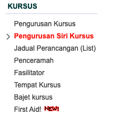

# Kaedah Penjanaan Sijil Kursus Akademi

## Pengenalan

Penjannaa sijil kursus adalah untuk menggantikan penggunaan sijil manual yang sudah tidak dikeluarkan lagi oleh Akademi. Peserta....

## Jana Sijil

Akses ke **`Kursus > Pengurusan Siri Kursus`**

paparan seperti berikut akan diberikan :

Hari ini kita akan belajar belajar bagimana untuk buat dokumen menggunakan mkdocs. mkdocs menggunakan bahasa markdown sebagai syntax. bukan mark adam. faham?

contohnya markdown ni boleh accept html tag, cuma markdown ni dia lebih ringkas dan tak berapa serabut macam tag html contohn sy akan guna tag html utk <b>bold</b>
atau <i>italic</i> atau saya nak guna utk tukar jd text besar dan color 
merah dan bold

tp tu adalah tag html biasa boleh masuk juga, untuk penulisan manual kita pakai standard makdorn.

## Tips kedua

Ini pula untuk buat bold **bold** baru akan jd bold. Untuk letakkan URL sebagai contoh kita nak bgtau kepada pembaca untuk ekses google:

utk buat link mcam dibawah : 

    [http://www.google.com](http://www.google.com)

Contohnya kata kita nak letak nama folder atau pun nama fail kita nak bezakan dengan text so kita akan letak tanda `cicak_kobing_punya_file.txt`. nampak tak perbezaan dia?

---

### Ini subheader ketiga

best? tak best? mcamana nak buat list? 

1. List 1 
2. list 2
3. list 3
4. List 4

Kena ada satu para. Ini lah para, para itu apa? paragraph lah para tu dkt sini untuk asing kalau tidak dia continue

* Bintang 1
* bintang 2

For full documentation visit [mkdocs.org](https://www.mkdocs.org).

kata pujangga 

> bagai bulan jatuh ke riba

| Syntax        | Description   |
| -----------   | -----------   |
| Header        | Title         |
| Paragraph     | Text          |

## Commands

* `mkdocs new [dir-name]` - Create a new project.
* `mkdocs serve` - Start the live-reloading docs server.
* `mkdocs build` - Build the documentation site.
* `mkdocs -h` - Print help message and exit.

## Project layout

    mkdocs.yml    # The configuration file.
    docs/
        index.md  # The documentation homepage.
        ...       # Other markdown pages, images and other files.
